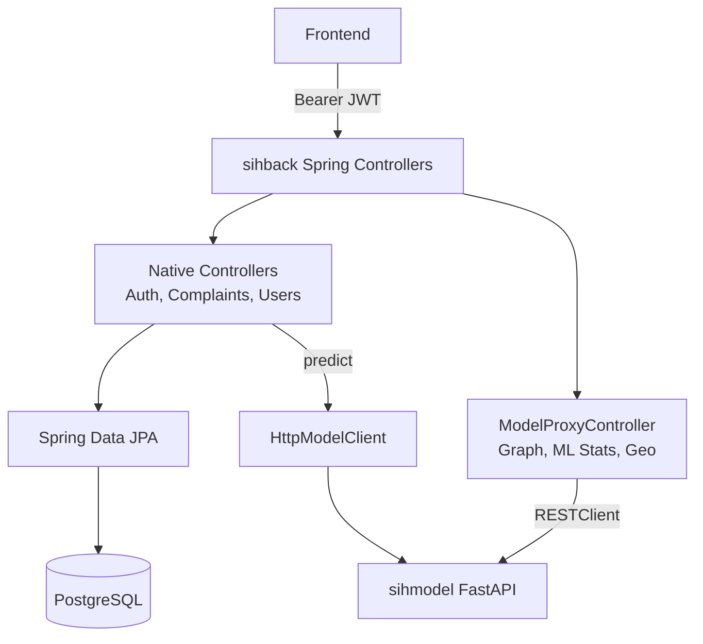

# sihback - Tritrinetraa API Gateway & Core Platform

## Purpose
`sihback` acts as the central API gateway, authentication layer, and system of record for the TRINETRAA platform. It handles secure REST API interactions with the `sihweb` frontend and acts as a bidirectional bridge to the `sihmodel` Python ML engine. All permanent structured data (users, auth, raw complaints, transaction logs, audit events) is stored here in PostgreSQL.

## Tech Stack
- **Language**: Java 21
- **Framework**: Spring Boot 3.4.2
- **Security**: Spring Security + JJWT 0.12 (Stateless JWT Auth)
- **Database ORM**: Spring Data JPA / Hibernate
- **Database Engine**: PostgreSQL
- **Migrations**: Flyway

## Package Structure
All source code resides under `src/main/java/com/sih/dataservice`:
- `admin/`: Roster and jurisdiction management.
- `auth/`: Spring Security config, JWT filters, and login endpoints.
- `complaints/`: Incident intake, evidence tracking, and case events (native).
- `freeze/`: SLA-bound emergency account freeze requests.
- `ml/`: The core `ModelProxyController` and `HttpModelClient` bridging to the Python engine.
- `stats/`, `health/`, `geo/`, `benchmarks/`, `graph/`: Feature-specific controllers (often proxied).
- `users/`: Bank and Cyber Officer entity definitions.
- `common/`: Global exception handlers and DTO responses (`ApiResponse<T>`).

## Architecture & Proxied Routing



`sihback` implements a dual-path architecture:
1. **Native Endpoints**: Standard Controller -> Service -> Repository -> Postgres flow.
2. **Proxied Endpoints**: Handled by `ModelProxyController` utilizing Spring 6 `RestClient`. The frontend requests ML-specific data (like `/api/incidents`), which Java securely intercepts (validating the JWT), transparently forwards to the Python `sihmodel`, and adapts the response back to the frontend.

## Full API Reference

| Controller | Method | Path | Roles | Native / Proxied | Description |
|------------|--------|------|-------|------------------|-------------|
| `AuthController` | POST | `/api/auth/staff/login` | *Public* | Native | Authenticates staff and returns JWT. |
| `ComplaintController` | POST | `/api/complaints` | CITIZEN | Native | Intake for new cyber fraud complaints. |
| `FreezeRequestController` | POST | `/api/freeze-requests` | LEO / ADMIN | Native | Initiates an SLA-bound account freeze. |
| `ModelProxyController` | GET | `/api/incidents` | LEO / ADMIN | Proxied | Fetches ranked incident queue from Python. |
| `ModelProxyController` | GET | `/api/incidents/{id}` | LEO / ADMIN | Proxied | Detailed incident dossier (with explainability adapter). |
| `ModelProxyController` | POST | `/api/predict/subgraph` | LEO / ADMIN | Proxied | Triggers live on-the-fly GraphSAGE inference. |
| `ModelProxyController` | POST | `/api/simulate/stream` | LEO / ADMIN | Proxied | Initiates a synthetic live-traffic ML simulation. |
| `ModelProxyController` | GET | `/api/stats`, `/api/ml-ops/*` | ADMIN | Proxied | Fetches MLOps telemetry and admin stats. |
| `IncidentController` | GET | `/api/legacy/...` | LEO | Native | Deprecated/renamed native routes that caused 500 mapping errors during demo integration. |

## Database Schema (PostgreSQL)

Key tables managed by Flyway (`V1__init.sql`):
- **Auth & Access**: `users`, `jurisdictions`, `banks`
- **Triage**: `complaints`, `entities`, `complaint_accounts`, `evidence`
- **Transactions**: `transactions`, `bank_uploads`
- **Actions**: `freeze_requests`, `case_events`, `notifications`, `whatsapp_sessions`
- **ML Metadata**: `training_snapshots`, `model_versions`, `predictions`

## Authentication Flow
TRINETRAA uses Stateless JWT Authentication.
1. User POSTs credentials to `/api/auth/staff/login`.
2. Java verifies against the `users` table and issues a signed JWT (`jjwt`) with standard claims (`sub` = username, `roles` = `[ROLE_CYBER_OFFICER]`).
3. Subsequent requests include `Authorization: Bearer <token>`. The `JwtAuthFilter` intercepts the request, builds a `UserPrincipal`, and populates the `SecurityContext`.
4. Controllers use `@PreAuthorize("hasAnyRole(...)")` to enforce RBAC.

## Environment Variables
- `DATABASE_URL`: PostgreSQL connection string (e.g., `jdbc:postgresql://localhost:5432/trinetraa`).
- `SPRING_DATASOURCE_USERNAME` / `PASSWORD`: DB credentials.
- `JWT_SECRET`: Base64-encoded secret key for signing tokens (HS256).
- `MODEL_SERVICE_URL`: The URL of the Python backend (e.g., `https://sihmodel-production.up.railway.app`).

## Local Development
```bash
# Compile and package (skipping tests for speed)
./mvnw clean package -DskipTests

# Run the Spring Boot application (defaults to port 8000)
./mvnw spring-boot:run
```
*Note: Ensure you have a local PostgreSQL instance running and the `MODEL_SERVICE_URL` environment variable properly pointing to a running instance of `sihmodel` (port 8080).*

## Deployment
Deployed via **Railway**. The repository contains a standard `Dockerfile` and `docker-compose.yml`. Railway automatically detects the Maven build and deploys the generated JAR. 

## Known Limitations & Demo Considerations
**Database Isolation Issue**: For the SIH hackathon demo, `sihmodel` (Python) operates on a highly curated SQLite dataset of 1000 simulated laundering rings, while `sihback` operates on an empty PostgreSQL database. 
Because of this isolation:
- New complaints filed natively via POST `/api/complaints` go to Postgres but are not synced to Python, meaning they won`t appear in the ML Incident Queue.
- Emergency Freezes relying on strict Postgres Foreign Keys (linking to `Complaint` UUIDs) will fail if targeted at Python mock entities (like `C000294`). The frontend currently handles this by falling back to local storage caching.

